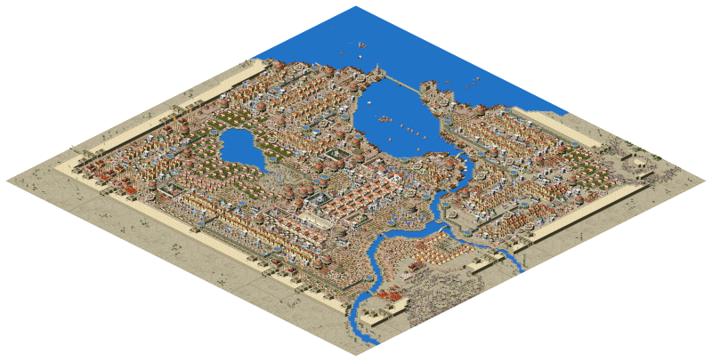

# Augustus 

[](https://github.com/Keriew/Augustus/actions)

 **💬 Join the Augustus Community - players, mapmakers, and developers**  
[](https://discord.gg/GamerZakh)  
kindly hosted by GamerZakh.

 **📜 Share Maps, Campaigns and Scenarios**  
[](https://caesar3.heavengames.com/downloads/lister.php?&category=augustus_scen&start=0&s=dls&o=d)  
Download Julius and Augustus scenarios, create your own and share with others! 

| Platform | Latest release | Unstable build |
|----------|----------------|----------------|
| Windows - 64 bit| Next release! |[](https://augustus.josecadete.net/download/latest/development/windows-64bit)   [(Download development assets)](https://augustus.josecadete.net/download/latest/development/assets)
| Windows - 32 bit  | [](https://augustus.josecadete.net/download/latest/release/windows)|[](https://augustus.josecadete.net/download/latest/development/windows)
| Linux AppImage | [](https://augustus.josecadete.net/download/latest/release/linux-appimage) | [](https://augustus.josecadete.net/download/latest/development/linux-appimage)
| Linux Flatpak | Next release! | [](https://augustus.josecadete.net/download/latest/development/linux-flatpak)
| Mac | [](https://augustus.josecadete.net/download/latest/release/mac) | [](https://augustus.josecadete.net/download/latest/development/mac) |
| PS Vita | [](https://augustus.josecadete.net/download/latest/release/vita)| [](https://augustus.josecadete.net/download/latest/development/vita) |
| Switch |  [](https://augustus.josecadete.net/download/latest/release/switch) | [](https://augustus.josecadete.net/download/latest/development/switch) |
| Android APK |  [](https://augustus.josecadete.net/download/latest/release/android) | [](https://augustus.josecadete.net/download/latest/development/android) |


Alternatively, you can [**try Augustus in your browser**](https://augustus.josecadete.net/play/). Note that you'll still need to provide a valid Caesar 3 installation folder.


Augustus is a fork of the Julius project that intends to incorporate gameplay changes.
=======
The aim of this project is to provide enhanced, customizable gameplay to Caesar 3 using project Julius UI enhancements.

Augustus is able to load Caesar 3 and Julius saves, however saves made with Augustus **will not work** outside Augustus.

Gameplay enhancements include:
- Roadblocks
- Market special orders
- Global labour pool
- Partial warehouse storage
- Increased game limits
- Zoom controls
- And more!

Because of gameplay changes and additions, save files from Augustus are NOT compatible with Caesar 3 or Julius. Augustus is able to load Caesar 3 save files, but not the other way around. If you want vanilla experience with visual and UI improvements, or want to use save files in base Caesar 3, check [Julius](https://github.com/bvschaik/julius).

Augustus, like Julius, requires the original assets (graphics, sounds, etc) from Caesar 3 to run. Augustus optionally [supports the high-quality MP3 files](https://github.com/bvschaik/julius/wiki/MP3-Support) once provided on the Sierra website.

[](https://github.com/user-attachments/assets/5027579d-4277-4b1f-9eca-297a04cb1c79)

## Running the game

First, download the game for your platform from the list above.

Alternatively, you can build Augustus yourself. Check [Building Julius](doc/BUILDING.md)
for details.

Then you can either copy the game to the Caesar 3 folder, or run the game from an independent
folder, in which case the game will ask you to point to the Caesar 3 folder.

Note that you must have permission to write in the game data directory as the saves will be
stored there. Also, your game must be patched to 1.0.1.0 to use Augustus. If Augustus tells you that
you are missing it, you can [download the update here](https://github.com/bvschaik/julius/wiki/Patches).

See [Running Julius](https://github.com/bvschaik/julius/wiki/Running-Julius) for further instructions and startup options.

## Manual

Augustus changes are explained in detail in the comprehensive manual. Below you can find the links to the manual in a few language versions.

| Language | Manual |
|----------|--------|
|English   |[Download](https://github.com/Keriew/augustus/raw/master/res/manual/augustus_manual_en_4_0.pdf)|
|Chinese   |[Download](https://github.com/Keriew/augustus/raw/master/res/translated_manuals/augustus_manual_chinese_3.0.pdf)|
|French   |[Download](https://github.com/Keriew/augustus/raw/master/res/translated_manuals/augustus_manual_fr_4_0.pdf)|
|Polish   |[Download](https://github.com/Keriew/augustus/raw/master/res/translated_manuals/augustus_manual_polish_3.0.pdf)|
|Russian   |[Download](https://github.com/Keriew/augustus/raw/master/res/translated_manuals/augustus_manual_russian_3.0.pdf)|

## Lua Scripting

Augustus supports **Lua scripting** for maps and scenarios, allowing you to add custom logic, dynamic events, and interactive dialogs to your scenarios.

### Getting started

1. Create a `.lua` file with the same name as your scenario (e.g. `valentia.lua` for `valentia.map`).
2. Place the script file next to the scenario file or in the game data directory.
3. The script is automatically loaded when the scenario starts.

### Lifecycle hooks

Define any of these functions in your script to react to game events:

| Hook | Called when |
|------|------------|
| `on_load()` | Scenario starts (after script is loaded) |
| `on_tick()` | Every game day |
| `on_month()` | Start of each month |
| `on_year()` | Start of each year |
| `on_event(event_name)` | A scenario event fires |
| `on_building_placed(type, x, y, id)` | Player places a building |
| `on_building_destroyed(type, x, y, id)` | A building is destroyed |
| `on_victory()` | Player wins |
| `on_defeat()` | Player loses |
| `on_invasion_start(type, size)` | An invasion starts |
| `on_trade_completed(route_id, resource, amount)` | A trade is completed |

### Available APIs

The following API modules are available in your scripts:

| Module | Description |
|--------|-------------|
| `scenario.*` | Scenario properties, variables, and events |
| `game.*` | Game time and flow control |
| `city.*` | City status and ratings |
| `building.*` | Building queries and counts |
| `map.*` | Map tiles and terrain |
| `resource.*` | Resource and trade goods |
| `finance.*` | Treasury and tax control |
| `population.*` | Population statistics |
| `empire.*` | Empire cities and trade routes |
| `ui.*` | Dialogs, messages, and log output |
| `sound.*` | Sound effects and music |

### Example script

```lua
function on_load()
    ui.log("Scenario loaded!")
    ui.input_dialog({
        title = "The Senate's Offer",
        text = "Accept a gift or gain favor with the gods?",
        buttons = {
            { label = "Accept Gold",  on_click = function() finance.add_treasury(1000) end },
            { label = "Pray to Gods", on_click = function() city.change_favor(10) end },
            { label = "Decline" },
        }
    })
end

function on_year()
    local pop = city.population()
    if pop >= 500 then
        ui.show_custom_message({
            title = "Growing City",
            text = "Your city has reached " .. pop .. " citizens!",
        })
    end
end
```

### IDE autocomplete

Download the **Lua API** artifact from the latest [GitHub Actions build](https://github.com/Keriew/augustus/actions) and extract the API definition files into your workspace to get full autocomplete and type hints in editors that support Lua Language Server (e.g. VS Code with the [Lua extension](https://marketplace.visualstudio.com/items?itemName=sumneko.lua)).

## Bugs

See the list of [Bugs & idiosyncrasies](https://github.com/bvschaik/julius/wiki/Caesar-3-bugs) to find out more about some known bugs.
