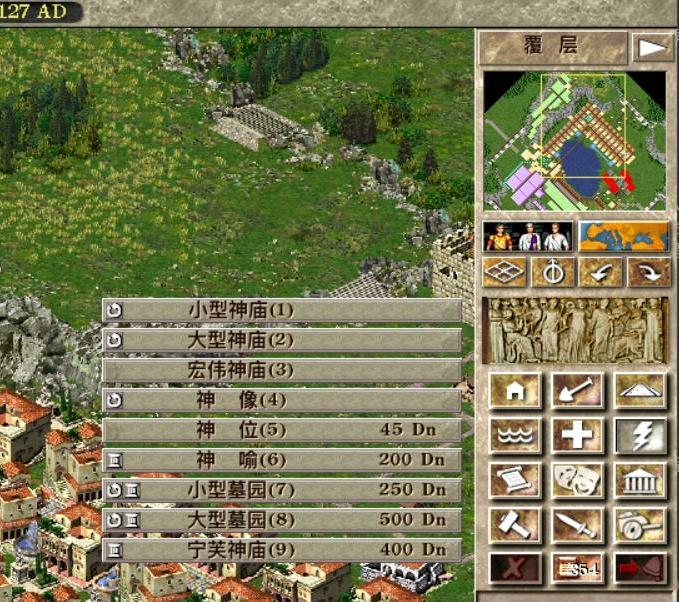
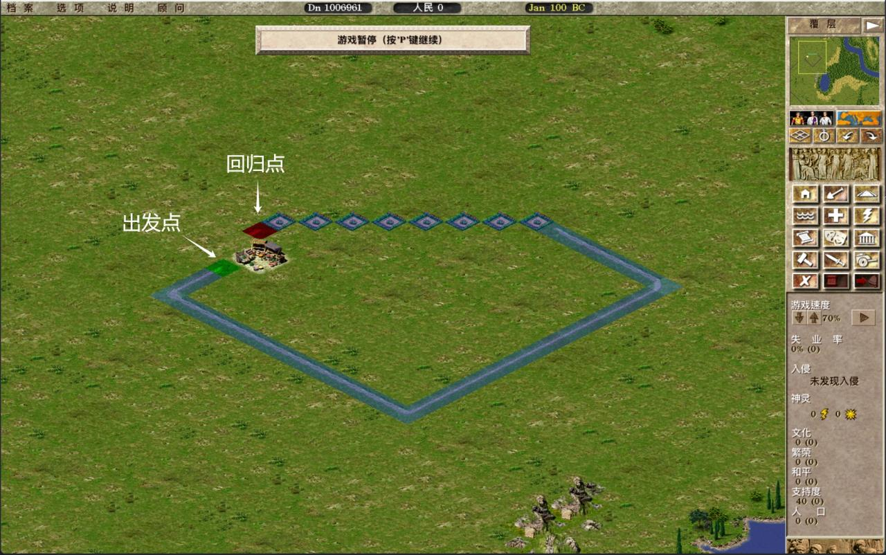
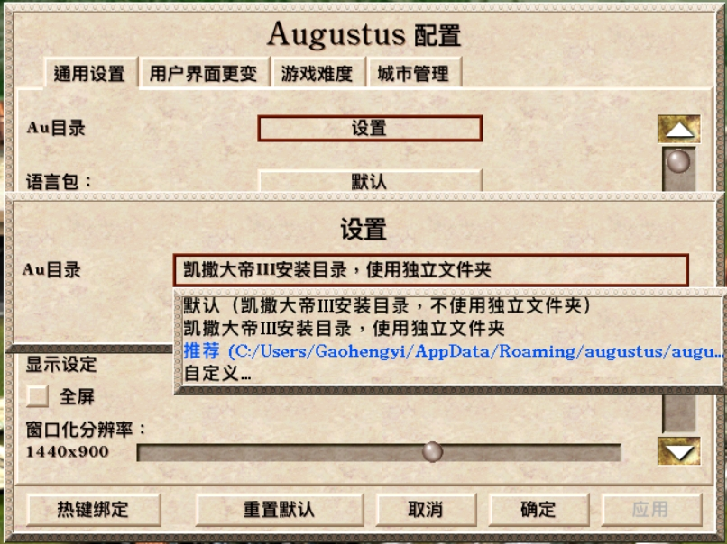

# 《凯撒大帝III之奥古斯都》 - 中文说明

## 序言
- 作为《凯撒大帝III》的老玩家，这款游戏承载了我许多童年的回忆和欢乐。很多年前在Steam上看到过玩家自制版的《凯撒IV》，游戏只开发了部分便停更。2025年初接触到`Julius`和`Augustus`时让我异常兴奋，因为这是由粉丝创造的完全开源免费的版本，不仅适配了最新的操作系统，更是实现了跨平台。

- `Augustus`基于`Julius`源码，增修部分玩法，修正bug，增强UI。但目前发布的4.0.0版本并不是最终版，仍在持续开发中，大伙都不是全职，闲暇时才为爱发电，更新进度异常缓慢。

- “奥版”中有两个功能让我回不到原版：“鼠标中键实时地图缩放”和“预览行人行走路线”，**地图缩放**后方便派兵操作，而**预览行人路线**可以立即看到受迫是否成功，十分便捷。

- 翻译问题：4.0.0版本的中文翻译不完整，于是pull代码自行翻译。然而游戏内含的中文字体库文字不全，很多字无法正常显示。向“J”版作者`@bvschaik`寻求帮助后得知，游戏字体文件是由原版凯撒团队制作，仅包含原版所用到的字符，他也表示无法解决（其实我觉得是他不愿意弄，重构游戏字体不但工程浩大，而且指不定会引发许多莫名其妙的bug）。这就给翻译带来了诸多无形枷锁，例如`obelisk`，新增的装饰性建筑，中文为`方尖碑`，但由于字体库不含`尖`字，游戏里就显示为`方?碑`，所以只能挑选可显示的文字，`obelisk`就被翻译成`奥贝里斯克`才能正常显示。就连市场大妈的`妈`字都没有，着实让人抓狂。当然这不单是简体中文的问题，繁体、韩文也是如此。

## 我的开发计划

> 人到中年精力有限，只能适机而为。

### 1. ✅ 前段时间抽空做了个建造菜单的功能增强来练手：点开建造菜单时增加0-9的数字快捷键。不过这个合并请求一直没有通过。想尝试的朋友可以试试。

### 2. 🟢 QQ群里大多朋友都是原版忠实玩家，所以我有意将**地图缩放**和**预览行人路线**引入`Julius`。研究了几天代码发现，“奥版”实现**地图缩放**几乎重构了整个渲染逻辑（SDL Renderer），工程量巨大；预览功能相对容易一些，但也不轻松。

### 3. 🟢 重构字体系统（长期），彻底解决**非字母系语言**的多语言问题。

## 以下是《Augustus 4.0用户指南》内容汇总，原文在这里：[Augustus 4.0 User Guide](https://gitee.com/xxoommd/augustus/raw/master/res/manual/augustus_manual_en_4_0.pdf)

> 我基本上只玩master版本，中文翻译也基于这个分支。期间发现某些游戏功能点与文档略有差别，或许4.0最终版发布时文档才会同步更新。

### 1. 基本配置

#### 1.1 游戏文件结构

与`Julius`类似，`Augustus`需要《凯撒大帝III》游戏原文件方能正常运行，不同的是`Augustus`引入了全新的建筑和行人，需要额外的资源文件（`assets`）。完整的`Augustus`文件如下（以Windows版为例）：

- `augustus.exe`: 程序入口文件
- `SDL.dll`和`SDL_mixer.dll`: SDL相关的库文件
- `assets`文件夹: 额外的资源文件

这三个文件（文件夹）缺一不可。

#### 1.2 自定义的用户目录

为了不和游戏源文件混淆交叉，`Augustus`添加了自定义用户目录，与`Augustus`相关的存档、战役、截图等都保存在这个目录内。这个目录可以放在电脑上任何位置，并且在游戏设置中你可以随时变更。（我在翻译的时候简写为`Au目录`）

